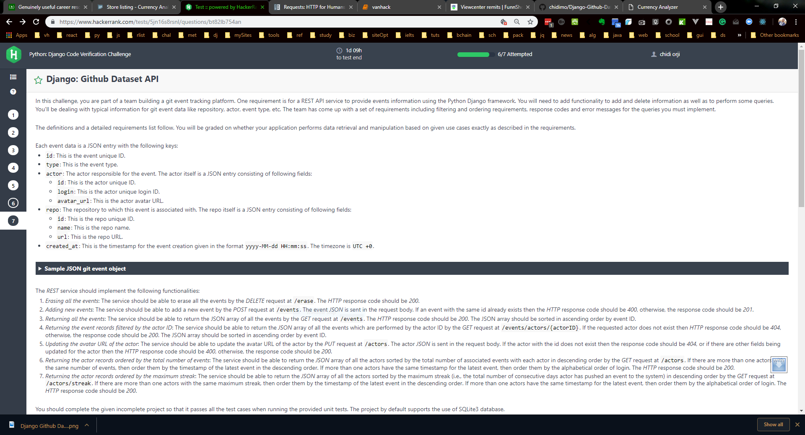

# Django-Github-Dataset-API

## Note

This project is from a [hackerrank](https://hackerrank.com) challenge. The original repo is included as `django--github-dataset-api-bt82lb754an.zip` in the project root.

## Challenge description

In this challenge, you are part of a team building a git event tracking platform. One requirement is for a REST API service to provide events information using the Python Django framework. You will need to add functionality to add and delete information as well as to perform some queries. You'll be dealing with typical information for get event data like repository, actor, event type, etc. The team has come up with a set of requirements including filtering and ordering requirements, response codes and error messages for the queries you must implement.

The definitions and a detail list follow. You will be graded on whether your application performs data retrieval and manipulation based on given use cases exactly as described in the requirements.

Each event data is a JSON entry with the following keys:

* `id`: This is the event unique ID.
* `type`: This is the event type.
* `actor`: The actor responsible for the event. The actor itself is a JSON entry consisting of the following fields

	* `id`: This is the actor unique ID.

	* `login`: This is the actor unique login ID.

	* `avatar_url`: This is the actor avatar URL.

* `repo`: The repository to which the event is associated. The repo itself is a JSON entry consisting of the following fields:

	* `id`: This is the repo unique ID.

	* `name`: This is the repo name.

	* `url`: This is the repo URL.

* `created_at`: This is the timestamp for the event creation given in the format `yyyy-MM-dd HH:mm:ss`. The timezone is `UTC +0`.

The REST service should implement the following functionalities:

1. *Erasing all the events*: The service should be able to erase all the events by the *DELETE* request at `/erase`. The *HTTP* response code should be *200*.
1. *Adding new events*: The service should be able to add a new event by the *POST* request at `/events`. The event JSON is sent in the request body. If an event with the same id already exists then the *HTTP* response code should be *400*, otherwise, the response code shoule be *201*.
1. *Returning all the events*: The service should be able to return the JSON array of all the events by the *GET* request at `/events`. The *HTTP* response code should be *200*. The JSON array should be sorted in ascending order by event ID.
1. *Returning the events records filtered by the actor ID*: The service should be able to return the JSON array of all the events which are performed by the actor ID by the *GET* request at `/events/actors/{actorID}`. If the requested actor does not exist then *HTTP* response code should be *404*, otherwise, the response code should be *200*.The JSON array should be sorted in ascending order by event ID.
1. *Updating the avatar URL of the actor*: The service should be able to update the avatar URL of the actor by the *PUT* request at `/actors`. The actor *JSON* is sent in the request body. If the actor with the ID does not exist then the response code should be *404*, or if there are other fields being updated for the actor then the *HTTP* response code should be *400*, otherwise, the response code should be *200*.
1. *Returning the actor records ordered by the total number of events*: The service should be able to return the JSON array of all the actors sorted by the total number of associated events with each actor in descending order by the *GET* request at `/actors`. If there are more than one actors with the same number of events, then order them by the timestamp of the latest event in the descending order. If more than one actors have the same timestamp for the latest event, then order them by the alphabetical order of login. The *HTTP* response code should be *200*.
1. *Returning the actor records ordered by the maximum streak*: The service should be able to return the JSON array of all the actors sorted by the maximum streak (i.e., the total number of consecutive days actor has pushed an event to the system) in descending order by the *GET* request at `/actors/streak`. If there are more than one actors with the maximum streak, then order them by the timestamp of the latest event in descending order. If more than one actors have the same timestamp for the latest event, then order them by the alphabetical order of login. The *HTTP* response code should be *200*.

You should complete the given incomplete project so that it passes all the test cases when running the provided unit tests. The project by default supports the use of SQLite3 database.

## Personal notes

### On provided test cases

In the provided test case below, the line

```python
self.assertEqual(sorted(json.loads(res.text)), sorted(row['response']['body']))
```

results in `TypeError: '<' not supported between instances of 'dict' and 'dict'` because python's `sorted()` function only works on lists. Replacing that line with

```python
self.assertEqual(sorted([actor["id"] for actor in json.loads(res.text)]), sorted([actor["id"] for actor in row['response']['body']]))
```

gives no error. The idea is to generate a list of `ID`s from both dictionaries and sort it. This change is effected in the ``working-test` branch of this repo. Running `python manage.py test` with this branch checked out produces no error.

```python
# -*- coding: utf-8 -*-
from __future__ import unicode_literals
from django.conf import settings
from django.test import TestCase
from rest_framework.test import RequestsClient
import json
from dateutil.parser import parse


class RestTestCase(TestCase):

    def setUp(self):
        self.test_1 = []
        with open('TestData/http01.json') as f:
            for line in f:
                self.test_1.append(line)

    def test_set_1(self):
        client = RequestsClient()
        for ro in self.test_1:
            row = json.loads(ro)
            res = {}
            if row['request']['method'] == "GET":
                res = client.get('http://localhost:8000' + row['request']['url'] + '/')
            elif row['request']['method'] == "POST":
                res = client.post(
                    'http://localhost:8000' + row['request']['url'] + '/', json=row['request']['body'])
            elif row['request']['method'] == "DELETE":
                res = client.delete(
                    'http://localhost:8000' + row['request']['url'] + '/')
            elif row['request']['method'] == "PUT":
                res = client.put('http://localhost:8000' + row['request']['url'] + '/', json=row['request']['body'])
            self.assertEqual(res.status_code, row['response']['status_code'])
            if row['response']['headers'] != {}:
                self.assertEqual(
                    res.headers['Content-Type'], row['response']['headers']['Content-Type'])
            if row['request']['url'] in ['/actors','/actors/streak'] and row['request']['method'] == 'GET':
                self.assertEqual(sorted([actor["id"] for actor in json.loads(res.text)]), sorted([actor["id"] for actor in row['response']['body']]))
                # self.assertEqual(sorted(json.loads(res.text)), sorted(row['response']['body'])) # original test
            elif row['response']['body'] != {}:
                response = json.loads(res.text)
                for resp in response:
                    if resp['created_at']:
                        temp = parse(resp['created_at'])
                        temp = temp.replace(tzinfo=None)
                        temp = str(temp)
                        resp['created_at'] = temp
                self.assertEqual(response, row['response']['body'])
```

### Summary of requirements

Action: *REQUEST METHOD*: **url**: `status code`: Return value

1. Erase all events: *DELETE*: **/erase**: `200`
1. Add new events: *POST*: **/events**: `400 or 201`
1. Return all events: *GET*: **/events**: `200`

        Sorted in ascending order by ID

1. Event records filtered by actor ID: *GET*: **/events/actors{actorID}**: `404 or 200`

        json array sorted in ascending order by event ID.

1. Update avatar url: *PUT*: **/actors**: `404` or `400` or `200`
1. Return actor records: *GET*: **/actors**: 200

        json array sorted by total number of events associated with actor in descending order.

1. Return actor records: *GET*: **/actors/streak**: `200`

        json array sorted by maximum streak (number of consecutive days actor has pushed)

## Question screenshot


